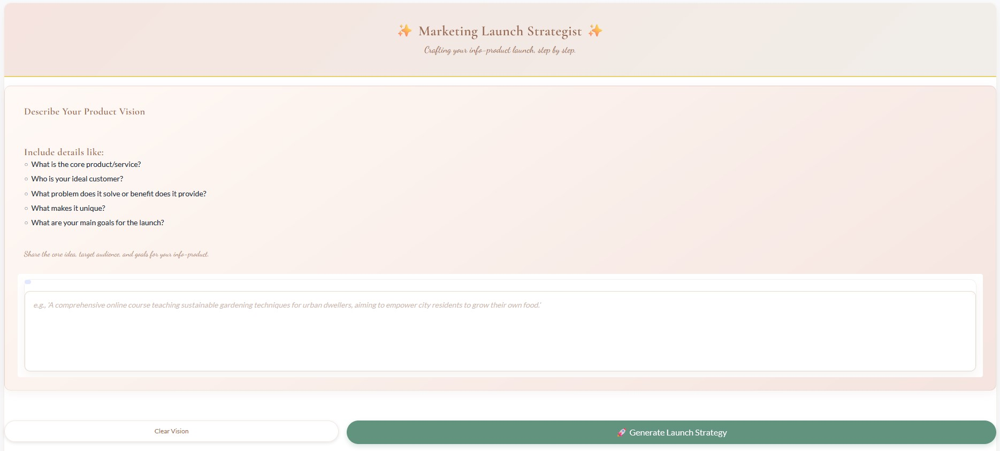

# Marketing Info Product Launch Crew (marketing112)

This project utilizes the CrewAI framework to automate the generation of a comprehensive marketing launch plan for an information product, primarily targeting a Portuguese-speaking audience. It takes user input describing the product, goals, and audience through a Gradio interface and uses a team of AI agents powered by Google Gemini to produce strategic documents and marketing content.



## Features

*   **Gradio Interface:** Provides a web interface using Gradio for user input and interaction.
*   **Knowledge Extraction:**
    *   **Agent:** `input_text_analyzer`
    *   **Task:** `extract_and_structure_knowledge_task`
    *   **Role:** Extracts key information from user input and structures it into the `FullProjectContext` model.
*   **Market & Competitor Analysis:**
    *   **Agent:** `lead_market_analyst`
    *   **Task:** `project_competitors_task`
    *   **Role:** Identifies and analyzes competitors, focusing on Instagram presence and broader market context.
*   **Strategy Development:**
    *   **Agent:** `chief_marketing_strategist`
    *   **Task:** `marketing_strategy_task`
    *   **Role:** Develops a comprehensive launch strategy, including phases, messaging, and KPIs.
*   **Content Creation:**
    *   **Agent:** `creative_content_creator`
    *   **Tasks:**
        *   `launch_angle_and_hook_task` - Develops creative angles for the launch.
        *   `create_lead_magnet_brief_task` - Defines the concept for a lead magnet.
        *   `write_optin_page_copy_task` - Crafts compelling opt-in page copy.
        *   `write_sales_page_copy_task` - Drafts long-form sales page copy.
    *   **Role:** Produces engaging content and copy in Portuguese for various marketing assets.
*   **Email Marketing:**
    *   **Agent:** `email_marketing_specialist`
    *   **Tasks:**
        *   `write_email_sequence_task_PRELAUNCH` - Creates pre-launch email sequences.
        *   `write_email_sequence_task_SALES` - Develops sales phase email sequences.
    *   **Role:** Designs and writes email sequences to nurture leads and drive sales.
*   **Social Media Management:**
    *   **Agent:** `social_media_manager`
    *   **Task:** `write_social_media_launch_posts_task`
    *   **Role:** Plans and drafts social media posts to build community and drive engagement.
*   **Content Review:**
    *   **Agent:** `chief_creative_director`
    *   **Task:** `review_launch_content_task`
    *   **Role:** Ensures all content aligns with brand voice and strategic goals.
*   **Final Report Compilation:**
    *   **Agent:** `final_report_synthesizer`
    *   **Task:** `compile_final_report_task`
    *   **Role:** Synthesizes all outputs into a comprehensive launch plan document.
*   **Powered by Gemini:** Utilizes Google's Gemini model for advanced language processing and task execution.
*   **Organized Output:** Saves generated reports to a dedicated `reports/` directory, with previous runs archived in `OldReports/`.

## Project Structure

```
marketing112/
├── .gitignore            # Specifies intentionally untracked files by Git
├── config/               # CrewAI agent and task configurations
│   ├── agents.yaml
│   └── tasks.yaml
├── knowledge/            # Stores user preferences or potentially other knowledge artifacts
│   └── user_preference.txt
├── src/
│   └── marketing112/
│       ├── __init__.py
│       ├── app.py          # <<< Gradio application entry point
│       ├── main.py         # Main entry point (potentially used by app.py)
│       ├── crew.py         # Crew definition, agents, tasks, LLM setup
│       ├── utils/
│       │   ├── __init__.py
│       │   └── util.py     # Utility classes
│       ├── crewV1.py       # Older crew version (not used)
│       └── mainV1.py       # Older main version (not used)
├── reports/              # <<< OUTPUT DIRECTORY for generated reports from the latest run
│   ├── 1structured_project_context_pt.md
│   ├── 2market_research_report_pt.md
│   ├── ... (other generated reports) ...
│   └── 13final_info_product_launch_plan_pt.md
├── OldReports/           # Archive of reports from previous runs
│   ├── 1/
│   ├── 2/
│   └── ...
├── tests/                # Placeholder for tests
├── requirements.txt      # Project dependencies
├── pyproject.toml        # Project metadata and build configuration
├── uv.lock               # Lock file for uv dependencies
└── README.md             # This file
```

## Setup

1. Clone the repository:
   ```bash
   git clone https://github.com/j-ferreiracosta/marketing112.git
   cd marketing112
   ```

2. Create a virtual environment:
   ```bash
   python -m venv .venv
   ```

3. Activate the virtual environment:
   ```bash
   .venv\Scripts\activate
   ```

4. Install dependencies:
   ```bash
   pip install -r requirements.txt
   ```

5. Deactivate the virtual environment:
   ```bash
   .venv\Scripts\deactivate.bat
   ```

6. Synchronize dependencies:
   ```bash
   uv sync
   ```

7. Reactivate the virtual environment:
   ```bash
   .venv\Scripts\activate
   ```

8. Install CrewAI:
   ```bash
   crewai install
   ```

9. Configure Environment Variables:
   ```bash
   cp .env.example .env
   ```
   * Add the following required variables:
     ```dotenv
     GEMINI_API_KEY="your_google_gemini_api_key"
     SERPER_API_KEY="your_serperdev_api_key"
     ```
   * Obtain a Gemini API key from [Google AI Studio](https://aistudio.google.com/app/apikey).
   * Obtain a Serper API key from [Serper.dev](https://serper.dev/) for the search tool.

## Usage

1.  **Activate Environment:**
    Ensure your virtual environment is active:
    ```bash
    .venv\Scripts\activate
    ```

2.  **Run the Gradio App:**
    Launch the application using the following command:
    ```bash
    python src/marketing112/app.py
    ```

3.  **Use the Interface:**
    *   Open your web browser and navigate to the local URL provided by Gradio (usually `http://127.0.0.1:7860`).
    *   Enter the required information about your product, audience, and goals into the input fields provided in the Gradio interface.
    *   Submit the form to start the CrewAI process.

4.  **Check Outputs:**
    *   Monitor the console where you ran the app for agent activity and logs.
    *   Check the `reports/` directory for the generated Markdown files (e.g., `market_research_report_pt.md`, `final_info_product_launch_plan_pt.md`, etc.). Previous runs' outputs are moved to numbered subdirectories within `OldReports/`.

## Configuration

*   **LLM:** Google Gemini (`gemini-pro`) is explicitly configured in `src/marketing112/crew.py`.
*   **Agents & Tasks:** The specific roles, goals, tools, and instructions for each AI agent and task are defined in `config/agents.yaml` and `config/tasks.yaml`. Modify these files to customize the crew's behavior.
*   **Tools:** The crew utilizes `SerperDevTool` for web searches and potentially `ScrapeWebsiteTool` (check `agents.yaml` for usage). Ensure API keys for any required tools are set correctly in your `.env` file.
